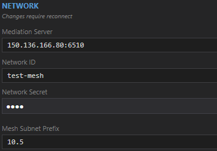

# NATTunnel

This program is currently a work in progress.

This is intended to be used to create a (mostly) decentralized peer-to-peer mesh network regardless of the NAT types that may be encountered. It's akin to tools like Hamachi and ZeroTier, but it implements some methods that are more capable of handling symmetric and CGNAT specifically, unlike these tools which often give up way too easily and simply fallback to relaying. Much of the info about how it works can be found in the OVERVIEW.md.

There are two ways to use NATTunnel:

- **As a daemon** that creates a system WireGuard interface (the original mode).
- **As an embedded library** that games / other UDP apps can link directly, with no WireGuard / kernel anything required (the embedded mode)

# Daemon mode

The only prerequisite is the WireGuard client, which can be downloaded [here](https://www.wireguard.com/install/).

## Config Instructions

Here is an example config with the only settings you really need to care about:



# Embedded library

The embedded library lets a host application (ex. game) join a NAT-traversed mesh network and treat each connected peer as a normal local UDP endpoint. Built atop `System.Security.Cryptography`'s ChaCha20-Poly1305 and a Noise XX handshake (via [Noise.NET](https://www.nuget.org/packages/Noise.NET)).

## Install

```
dotnet add package NATTunnel
```

## Minimal example

```csharp
using NATTunnel;
using System.Net;
using System.Net.Sockets;
using System.Text;

// 1. Host app binds its own UDP socket on a known loopback port — this is where
//    incoming packets from peers will arrive.
const int hostGamePort = 51000;
var hostSocket = new UdpClient(new IPEndPoint(IPAddress.Loopback, hostGamePort));

_ = Task.Run(async () =>
{
    while (true)
    {
        var pkt = await hostSocket.ReceiveAsync();
        // pkt.RemoteEndPoint is the loopback endpoint of the sending peer.
        Console.WriteLine($"Got {pkt.Buffer.Length} bytes from {pkt.RemoteEndPoint}");
    }
});

// 2. Configure + start the mesh node.
using var node = new MeshNode(new MeshConfig
{
    NetworkID = "my-game-lobby-42",
    NetworkSecret = "shared-secret",
    MediationEndpoint = "sync.milesthenerd.net:6510",
    HostGamePort = hostGamePort,
    // Optional: persistent identity, relay capacity, etc.
    // PersistentPeerID = playerAccountGuid,
    // MinLogLevel = LogLevel.Warning
    // Logger = line => Console.WriteLine(line),
});

node.PeerConnected += peer =>
{
    Console.WriteLine($"Peer joined: {peer.PeerID} via {peer.LoopbackEndpoint}");
    // Send to peer.LoopbackEndpoint as if it were any remote UDP endpoint.
    byte[] hello = Encoding.UTF8.GetBytes("hello!");
    hostSocket.Send(hello, hello.Length, peer.LoopbackEndpoint);
};

node.PeerDisconnected += peer =>
{
    Console.WriteLine($"Peer left: {peer.PeerID}");
};

node.Start();

// Block until you're done — e.g. wait for a shutdown signal.
await Task.Delay(-1);
```

## Alternate example

```csharp
using NATTunnel;
using System.Net;
using System.Net.Sockets;
using System.Text;

// 1. Host app binds its own UDP socket on a known loopback port — this is where
//    incoming packets from peers will arrive.
const int hostGamePort = 51000;
var hostSocket = new UdpClient(new IPEndPoint(IPAddress.Loopback, hostGamePort));

_ = Task.Run(async () =>
{
    while (true)
    {
        var pkt = await hostSocket.ReceiveAsync();
        // pkt.RemoteEndPoint is the loopback endpoint of the sending peer.
        Console.WriteLine($"Got {pkt.Buffer.Length} bytes from {pkt.RemoteEndPoint}");
    }
});

// 2. Configure + start the mesh node.
using var node = new MeshNode(new MeshConfig
{
    NetworkID = "my-game-lobby-42",
    NetworkSecret = "shared-secret",
    MediationEndpoint = "sync.milesthenerd.net:6510",
    HostGamePort = hostGamePort,
    LocalIdentity = Encoding.UTF8.GetBytes("server"), // 256 byte limit
    ReliableMessageTimeout = TimeSpan.FromSeconds(10), // default 5s
});

node.PeerConnected += peer =>
{
    var identity = Encoding.UTF8.GetString(peer.Identity);
    if (identity == "server")
    {
        // client connect logic here
    }
};

node.MessageReceived += async (peer, bytes) => {
    var str = Encoding.UTF8.GetString(bytes);
    Console.WriteLine($"Got msg {str} from {peer.PeerID}");

    // send same bytes back
    await node.SendMessageAsync(peer, bytes, reliable: true);
    // or
    await node.BroadcastAsync(bytes, reliable: false);
}

node.Start();

// Block until you're done — e.g. wait for a shutdown signal.
await Task.Delay(-1);
```

## What you get

- **Direct UDP connectivity to every peer in the mesh**, even across symmetric NAT and CGNAT (via the introducer-driven hole-punching protocol).
- **End-to-end encrypted transport.** Noise XX handshake on first contact; ChaCha20-Poly1305 with explicit per-packet nonces (UDP-safe) for steady-state data.
- **Userspace relay forwarding** for peer pairs that can't direct-connect (rare). Relay nodes only see ciphertext, never plaintext.
